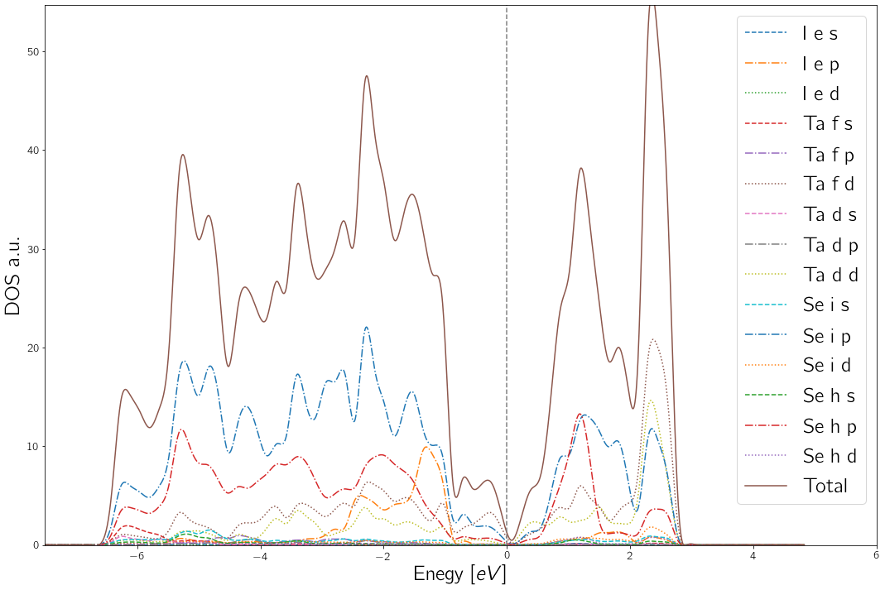
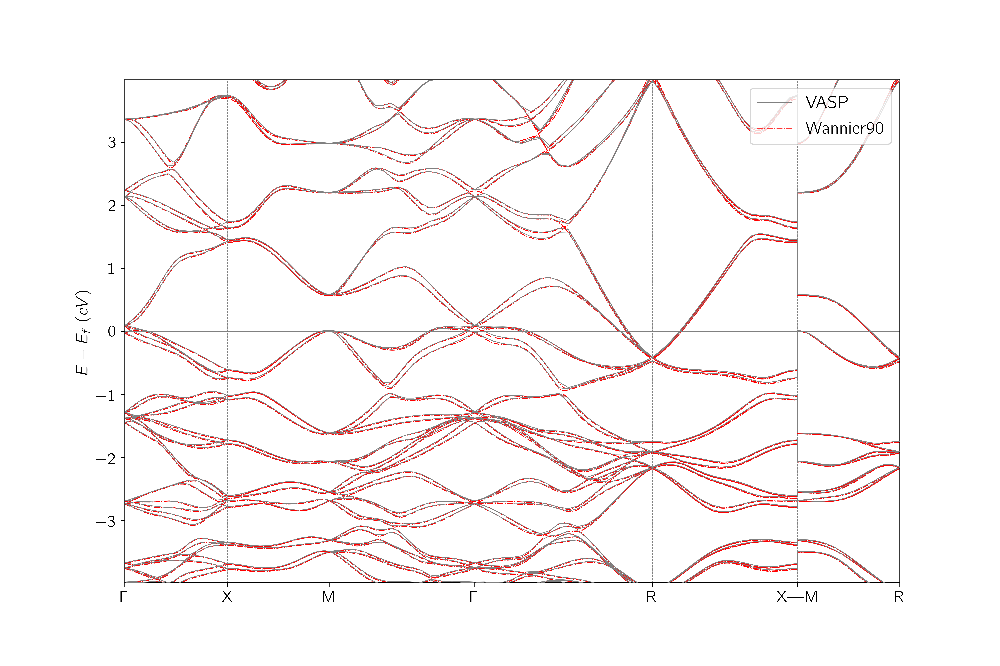

# WASPP module
**W**annier90 &amp; v**ASP** **P**ostprocessing module with functionalities I needed during my PhD. 

**Being updated**
Version: 0.5

## Main functions:
### Wannier90 - VASP interface preparation and evaluation.

1. ``` plot_pdos ```

For plotting pDOS select `LORBIT = 11` in `INCAR` file

Main function for plotting the partial density of states, for desired atoms and orbitals at all the different Wyckoff positions. Usage is straightforward:

* `file = "vasprun.xml"` of your VASP run.
* `_atoms` = Atoms whose pDOS you wanna plot as a list of strings e.g. ["P","I","O","Rn","Al"].
* `_orbitals` = Orbitals whose pDOS you wanna know from _atoms as a list of strings. They can be "big" orbitals (s,p,d,f) or "small" (px,py,pz,dxy,...), e.g ["s","px","d"].
* `e_window` = Range of energies of interest.

If `_atoms` and `_orbitals` are `None`, the function will plot every atom and big orbital at every different Wyckoff position. For a better visualization each kind of big orbital is displayed with a different linestyle.

For example (Ta6Se24I2): 
```import WASPP_0.5 as wap
wap.plot_dos("vasprun.xml",e_window = (-7.5,4))
```

Returns:



The first tag in the legend is the atom, the second is the Wyckoff position and the third the orbital.


2. ``` band_counter ```

Counts the numebr of bands in a energy window in the whole FBZ. It gives a good clue of how to choose the energy window. Usage is as following:

``` 
wap.band_counter(file = "vasprun.xml", emin = 0.0, emax = 0.0)
```
* `file = "vasprun.xml"` of your VASP run.
* `emin` and `emax` are the lower and upper part of the energy window given in reference to Fermi energy.

For example:
```
wap.band_counter(file = "vasprun.xml", emin = -7.0, emax = 4.0)
```
Returns:
```
Efermi = 3.01610496.
Total bands = 544.
The number of bands between -7.00 eV (-3.98 eV) and 4.00 eV (7.02 eV) is 368.
```
Which is, the Fermi energy in eV, the total number of bands of the vasp run and the number of bands in the energy window (with real energies in parenthesis for wannier90.win)

3. ` plot_wannierbands `

Function for plotting wannier bands from `.dat` and `.gnu` files.

Usage:

```
wap.plot_wannierbands(file_dat = "wannier90_band.dat", gnu = "wannier90_band.gnu",efermi = 0.0, e_window = None, fig_size = (15,8),savename = "wannierbands.png")
```
* `file_dat`: `*_band.dat` output file from a wannier90.x run.
* `file_dat`: `*_band.gnu` output file from a wannier90.x run.
* `efermi`: Fermi energy.
* `e_window` = Energy window for the plot

It generates a `"wannierbands.png"` file.

4 . `plot_vaspbands`

Function for plotting VASP bands from a non self-consistent calculation in a KPATH. Usage:

`wap.plot_vaspbands(outcar = "OUTCAR", kpoints = "KPOINTS")`

* `outcar`: OUTCAR file from VASP run.
* `kpoints`: KPOINTS file from nsc VASP run (linemode expected).

5. `plot_comparison`

Function for comparing VASP and Wannier90 bandstructures combining the previous functions and tags. Usage:

``` 
wap.plot_comparison(outcar = "OUTCAR", kpoints = "KPOINTS",file_dat = "wannier90_band.dat", gnu = "wannier90_band.gnu",efermi = 0.0, fig_size = (12,8), e_window = (-4,4),savename = "comparison.png"):
```

* `outcar`: OUTCAR file from VASP run.
* `kpoints`: KPOINTS file from nsc VASP run (linemode expected).
* `file_dat`: `*_band.dat` output file from a wannier90.x run.
* `file_dat`: `*_band.gnu` output file from a wannier90.x run.
* `efermi`: Fermi energy.
* `e_window` = Energy window for the plot

Example (badly frozen e_win chosen in NbGe2):
 ``` 
 wap.plot_comparison(outcar = "OUTCAR", kpoints = "KPOINTS",file_dat = "wannier90_band.dat", gnu = "plottt/wannier90_band.gnu",efermi = 0.0, fig_size = (12,8), e_window = (-4,4),savename = "comparison.png") 
 ```
 
 
6. `wann_kpoints`

Function for generating kpath string for `seedname.win` using a `KPOINT` file from a nsc VASP calculation. Usage is as follows:
```
wann_kpoints(file = "KPOINTS")
```
Where `KPOINTS` is like:

```
Cubic
20   ! 20 grids
Line-mode
reciprocal
   0.000   0.000   0.000   ! GAMMA
   0.000   0.500   0.000   ! X
   0.000   0.500   0.000   ! X
   0.500   0.500   0.000   ! M
   0.500   0.500   0.000   ! M
   0.000   0.000   0.000   ! GAMMA
   0.000   0.000   0.000   ! GAMMA
   0.500   0.500   0.500   ! R
   0.500   0.500   0.500   ! R
   0.000   0.500   0.000   ! X
   0.500   0.500   0.000   ! M
   0.500   0.500   0.500   ! R
```
And it generates a `WKPTS.txt` file as:
```
G 0.000 0.000 0.000 X 0.000 0.500 0.000 
X 0.000 0.500 0.000 M 0.500 0.500 0.000 
M 0.500 0.500 0.000 G 0.000 0.000 0.000 
G 0.000 0.000 0.000 R 0.500 0.500 0.500 
R 0.500 0.500 0.500 X 0.000 0.500 0.000 
M 0.500 0.500 0.000 R 0.500 0.500 0.500 
```

### MBJ and PBE potentials bandstructure comparison.

` compare_MBJ `

Function for comparing PBE nscc and MBJ scc functional bandstructures using pymatgen treatment of vasprun. 

```
wap.compare_MBJ(vasprun_pbe = "vasprun1.xml",
            vasprun_mbj = "vasprun2.xml",
            kpoint_file = "KPOINTS",
            e_window = (-4,4),
            fig_title = None,
            fig_name = "comparison.png")
```
Usage:
* `vasprun_pbe`: vasprun file for PBE nsc run.
* `vasprun_mbj`: vasprun file for MBJ scc run.
* `kpoint_file`: kpoint file for nsc (linemode expected).

For example:

```
wap.compare(vasprun_pbe = "vasprun81_rel.xml",
            vasprun_mbj = "vasprun81.xml",
            kpoint_file = "KPOINTS",
            e_window = (-2,2),
            fig_title = "SG81",
            fig_name = "comparison81.png")
```

Returns:


More functionalities are present in the code and many more are coming, stay tuned & take a look at WASPP05.py （＾³＾）～♪.

Package Requeriments:
* numpy
* matplotlib
* scipy
* itertools
* re
* pymatgen
